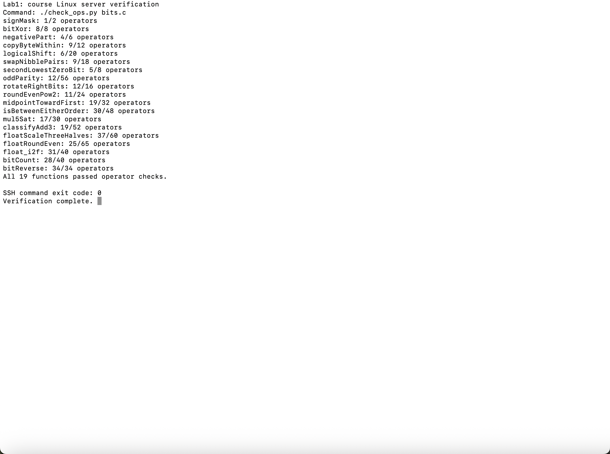
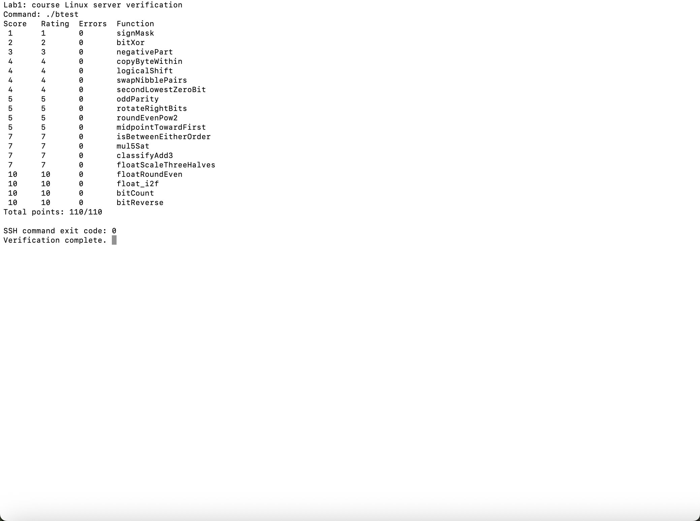

# 实验1 Data Lab 实验报告

实验日期：2026 年 10 月 9 日

本实验完成 19 个受限运算函数，练习 32 位补码、掩码、移位、溢出判断以及 IEEE 754 单精度浮点数的表示和舍入。课程服务器上的规则检查全部通过，正确性测试得分为 **110/110**。

## 实验环境与验证

代码在 Mac 上准备，通过 SSH 连接课程提供的 x86-64 Linux 服务器验证。服务器使用 GCC 13.3.0，按模板中的 `-O -Wall -fwrapv -m32` 编译。首次构建提示缺少 `bits/libc-header-start.h`，安装 `gcc-multilib` 和 `libc6-dev-i386` 后构建成功。没有修改函数签名、测试程序、Makefile 或 `.github` 评分配置。

首次完整验证执行了以下命令。修改 `bits.c` 后需要重新编译，以确保测试的是最新代码。

```bash
make clean
make all
./check_ops.py bits.c
./btest
./test.sh
```

规则检查输出 `All 19 functions passed operator checks.`，`btest` 中全部函数的 `Errors` 为 0，最后输出 `Total points: 110/110`。`./test.sh` 返回状态码 0。

以下为本次复核时直接截取的 macOS Terminal 输出区域：命令通过 SSH 在课程服务器执行，显示实际返回的输出。对应的[复核规则检查日志](assets/ops-review.log)和[复核正确性测试日志](assets/btest-review.log)一并保存。首次验证的[规则检查日志](assets/ops.log)、[正确性测试日志](assets/btest.log)和[完整测试日志](assets/server-test.log)也保留在仓库中。

### 规则检查截图



### 正确性测试截图



## 各函数实现思路

### P1 signMask

将常量 `1` 左移 31 位，生成仅最高位为 1 的掩码 `0x80000000`。该操作按实验规定的 32 位位向量模型解释。

### P2 bitXor

异或在两位不同时为 1。先分别构造 `x & ~y` 和 `~x & y`，再根据德摩根律把二者的或改写为仅使用 `~` 与 `&` 的表达式，共使用 8 个运算符。

### P3 negativePart

`x >> 31` 在负数时为全 1，在非负数时为全 0。把补码取反加一得到的 `~x + 1` 与该掩码相与，选择负数的相反数或零。`INT_MIN` 的相反数保留低 32 位，结果仍是 `0x80000000`，符合题目的机器模型。

### P4 copyByteWithin

字节编号乘以 8 用左移 3 位实现。将源字节右移并与 `255` 相与提取，再清空目标字节，最后把源字节放入目标位置。提取发生在修改之前，因此源位置与目标位置相同也能正确处理。

### P5 logicalShift

先算术右移，再屏蔽高位补入的符号位。掩码为 `~(((1 << 31) >> n) << 1)`：右移 `n` 位时保留低 `32-n` 位。`n=0` 时掩码为全 1，`n=31` 时仅保留最低位，移位量始终合法。

### P6 swapNibblePairs

由小常量构造 `0x0f0f0f0f`，提取每个字节的低半字节并左移 4 位；另一部分右移 4 位后用同一掩码提取，最后合并。掩码消除了算术右移产生的高位符号扩展。

### P7 secondLowestZeroBit

`x | (x + 1)` 将最低的零位变为 1，已有的其他 1 位保持不变。设结果为 `filled`，`~filled & (filled + 1)` 就能标记其最低零位，也就是原输入的第二低零位。原输入不足两个零位时结果自然为零。

### P8 oddParity

依次把 `x` 与右移 16、8、4、2、1 位的结果异或，将所有位的异或值折叠到最低位。最低位为 0 表示 1 的个数为偶数，题目此时要求返回 1，因此最后计算 `!(x & 1)`。

### P9 rotateRightBits

先用 `n & 31` 将位数对 32 取模。右移部分按 P5 的方法转换为逻辑右移，左移部分的位数为 `(~n + 1) & 31`，最后相或。`n` 是 32 的倍数时两部分都不移位，避免了移位 32 位的问题。

### P10 roundEvenPow2

设半程值为 `half = 2^(n-1)`，`odd = (x >> n) & 1` 表示原商是否为奇数。向 `x` 加上偏置 `half - 1 + odd`，再清除低 `n` 位。余数小于半程时向下舍入，大于半程时向上舍入，恰好等于半程时由商的奇偶决定，从而实现最近偶数舍入。

### P11 midpointTowardFirst

利用恒等式 `x+y = 2*(x&y) + (x^y)`，用 `(x & y) + ((x ^ y) >> 1)` 求向负无穷取整的平均数，避免直接求和的溢出。若最低位不同，平均数是半整数；只有第一参数更大时才补 1，使结果靠近第一参数。比较时先区分异号输入，同号输入再利用差值符号判断，避免比较过程溢出。

### P12 isBetweenEitherOrder

分别判断 `x<a` 与 `x<b`。异号时由 `x` 的符号判断，同号时使用 `x-a` 或 `x-b` 的符号。在不等于端点的情况下，两个比较结果不同时，`x` 位于两个端点之间；再显式包含 `x==a` 与 `x==b`，得到闭区间判断，并支持端点顺序相反或相等。

### P13 mul5Sat

依次计算两倍、四倍与五倍。检查每次计算后的符号是否发生不应有的变化，生成溢出掩码；即使最终符号因多次回绕恢复，也会被中间步骤捕获。饱和值根据原输入符号选择 `INT_MAX` 或 `INT_MIN`，再通过掩码选择正常结果或饱和值。

### P14 classifyAdd3

分两步计算 `sum=x+y`、`total=sum+z`。每次有符号加法用 `~(a^b) & (a^result)` 的符号位检测溢出：正溢出贡献修正量 `+1`，负溢出贡献 `-1`，不溢出贡献 0。精确数学和满足 `x+y+z = total + (correction1+correction2)*2^32`。三个 32 位整数的和使最终修正量只能是 -1、0 或 1，分别对应下溢、不溢出和上溢。两步出现方向相反的溢出时修正量抵消，能处理如 `INT_MAX + 1 - 1` 的情况。

### P15 floatScaleThreeHalves

拆出符号、阶码和尾数，NaN 与无穷大保持原编码。非规格化数将尾数乘 3 再除 2，按最近偶数舍入；尾数超过非规格化范围时结果编码自然进入最小阶码的规格化区间。规格化数补回隐藏的最高位，将有效数乘 3：根据乘积大小右移 1 或 2 位，并相应调整阶码。根据被舍弃部分与半程值的大小及保留部分的奇偶舍入，处理舍入进位；阶码达到 255 时返回带原符号的无穷大。零的符号被保留。

### P16 floatRoundEven

按照阶码分情况处理。绝对值小于 0.5 时返回带原符号的零；在 `[0.5,1)` 范围内，恰好 0.5 舍入到零，其他数舍入到 1。绝对值至少为 `2^23` 的有限单精度数已经是整数，NaN 和无穷也直接保留。其余值由阶码确定小数部分对应的低位数，清除这些位，并根据余数与半程值比较；恰好半程时仅在保留整数为奇数时进位。负数使用同样的绝对值舍入规则，保留符号。

### P17 float_i2f

将整数的符号与无符号绝对值分开，负数在无符号域中计算 `0-magnitude`，从而正确处理 `INT_MIN`。找到最高 1 位，其位置决定阶码。有效位不足 24 位时左移补齐；超过 24 位时保留高位，并根据低位余数执行最近偶数舍入。舍入使有效数产生进位时，再调整最高位位置和阶码。

### P18 bitCount

使用并行分组求和。先用 `0x55555555` 将相邻两位的 1 数量相加，再用 `0x33333333` 汇总成每四位的计数，用 `0x0f0f0f0f` 汇总到每字节。随后累加各字节并保留低 6 位，得到 0 到 32 的计数。所有掩码均由不超过 255 的常量构造，共 28 个运算符。

### P19 bitReverse

依次交换相邻的 1 位、2 位、4 位、8 位分组，最后交换高低 16 位。为满足 34 个运算符的上限，先构造 `mask16=0x0000ffff`，再依次用 `m ^ (m << shift)` 生成 `0x00ff00ff`、`0x0f0f0f0f`、`0x33333333` 和 `0x55555555`。每一阶段右移部分都经过掩码，以去掉符号扩展，最终实现完整的 32 位反转，共 34 个运算符。

## 参考资料

- [课程 DataLab 模板仓库](https://github.com/ICS-26Fall-FDU/DataLab)：题目注释、编码限制、参考行为与检查工具。
- [课程实验1说明](https://ics-26fall-fdu.github.io/labs/lab1-data-lab/)及[实验入门手册](https://ics-26fall-fdu.github.io/labs/manual/)

## AI 使用说明

使用 OpenAI Codex 辅助代码实现、算法推导、调试、环境配置、测试执行及报告整理。
